# Basic Info

#### Project Title
Illumination Control 🔆 Using Computer Vision 👁
#### Team Members 
- [Kaustav Saha](https://github.com/Kaustav-45)
- [Subhadeep Das](https://github.com/subhadeep01)
- [Soham Patra](https://github.com/Sohampatra1)
- [Raunak Gayen](https://github.com/RaunakGN2001)
#### Broad Areas our project focuses on
- Computer Vision
- Hand Gesture Recognition System
- Arduino
#### Hardware we used
- Arduino Nano V3
- Jumper Wires
- Breadboard
- LED
- 220Ω Resistor
- Cable for Arduino Nano
#### Software we used
- Arduino IDE
- PyCharm
- Jupyter Notebook
#### Python Libraries we used
- OpenCV-Python
- Mediapipe
- Pyserial
- Numpy
- Python-Math

# Introduction

### What is Computer Vision 
Computer vision is a field of Artificial Intelligence (AI) that enables computers and systems to derive meaningful information from digital images, videos, and other visual inputs and take actions or make recommendations based on that information. If AI enables computers to think, computer vision enables them to see, observe and understand. Computer Vision is indeed is a broad area of study with many specialised tasks and techniques, and also specialisations to target application domains.

### What is Hand Gesture Recognition System
A Hand Gesture Recognition System recognises the Shapes and orientation depending on implementation to task the system into performing some job. Gesture is a form of non-verbal information. As humans through vision perceive human gestures and for computer we need a camera, it is a subject of great interest for computervision researchers such as performing an action based on gestures of the person.

### How does Hand Gesture Recognition work?

 

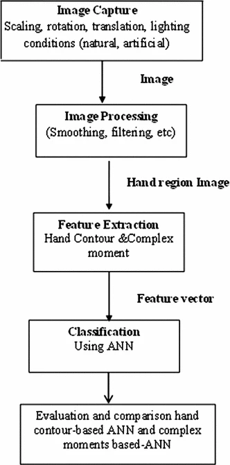

 
 

The Hand Gesture Recognition Algorithm involves the following steps:

- **Data Obtaining**: It's the process where image is captured from camera or in terms of frames per second via a webcam and a region of interest (ROI) is defined in the frame. The procured image is in RGB format.
- **Data Pre-Processing**: Pre-Processing is carried out in 2 steps - Segmentation and Morphological filtering. Segmentation is performed to change over grey-scale picture into binary picture in ordet to have 2 Areas of Interest in picture. Segmentation itself has 2 processes - 
  - Pixel based or Local methods like Edge Detection and Boundary Detection
  - Region based approach like Region Merging, Region Splitting, and Threshold Method

  Morphological Filtering involves some techniques as mentioned below - 
  - Contours
  - Finding and correcting Convex Hulls
  - Mathematical Operations

   

  

 

# Description

The purpose of this project is the use of Computer Vision and Arduino to control the Brightness of LED Lamp through Hand Gestures. The programming languages that have been used throughout the project are Python 3.7 for Computer Vision and C for Arduino.

# Working of the Python Code
First and foremost we need to install the required modules via the following commands - 
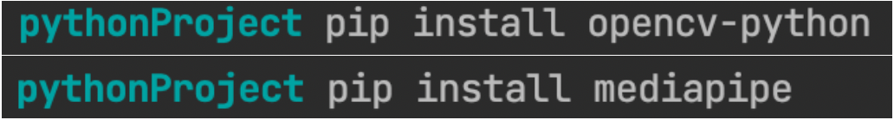
After it's done lets first check whether our Webcam is working or not via a piece of python code as given below.
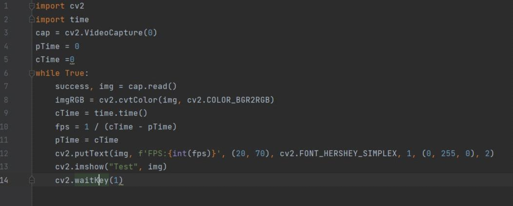
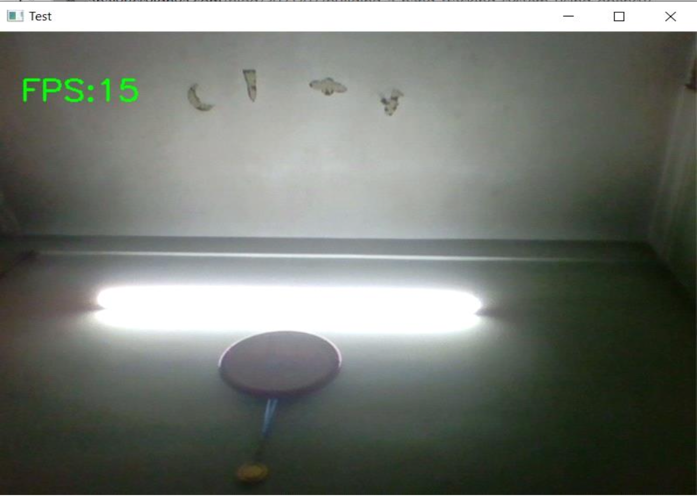
Our PC is working fine as we can see and it also shows Frames per second (FPS) on the top left corner of the output window. 

### Sneak peek into [HandTrackingModule.py](HandTrackingModule.py)
Our HandTrackingModule.py file consists of a handDetector Class that has been implemented to detect hand. It exports the landmarks in pixel format. Some extra functionalities have also been added like finding how many fingers are up or distance between two fingers and it also provides bounding box info of the hand format.

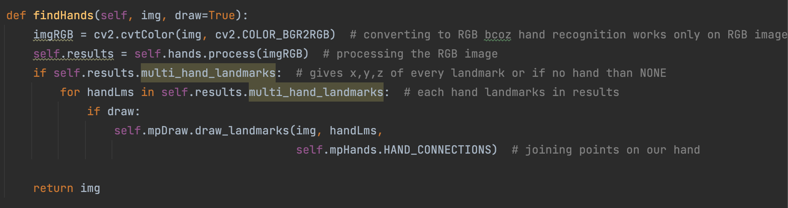
The function findHands() as stated in the above piece of code accepts an RGB image and searches for hands in the same. It takes the image as one of its arguments, and takes a flag argument to draw output on the image. The function returns an Image with or without drawings.
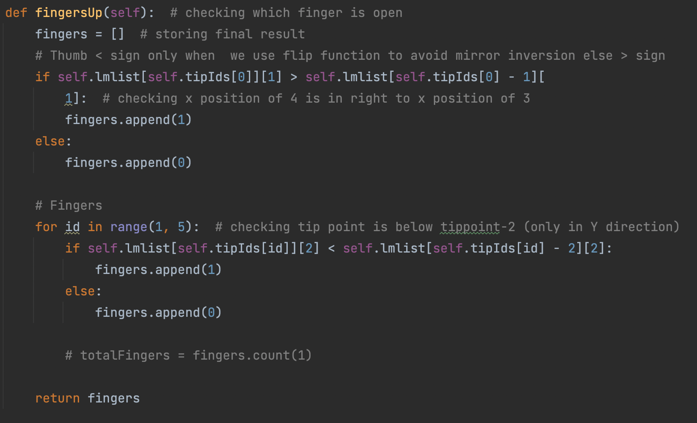
The function fingersUp() as stated in the above piece of code is used to find how many fingers are open and returns answer in a list. It considers left and right hands separately. It returns a list of which fingers are up.
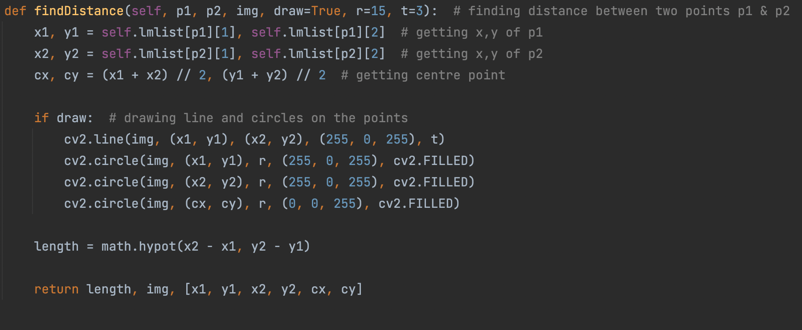
As we can see here findDistance() function finds distance between two landmarks based on their index numbers. It takes two points p1 and p2 as arguments and an image to draw on and returns the image with distance between those 2 points p1 and p2 drawn on it.  
  

The findPosition() function gives the position of the hand along with the id.

Finally comes the main() function where we initialize our model and also write a while loop to run the model.
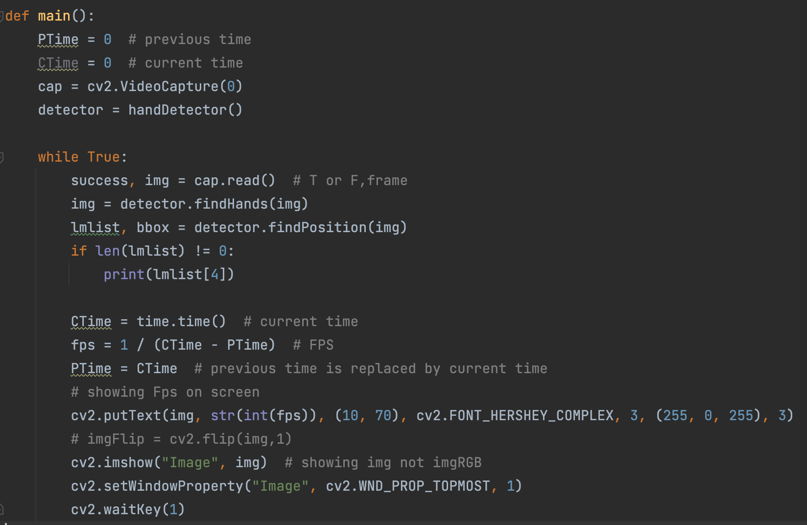
Now on successful running of HandTrackingModule.py we are getting this as output as given in the picture below.
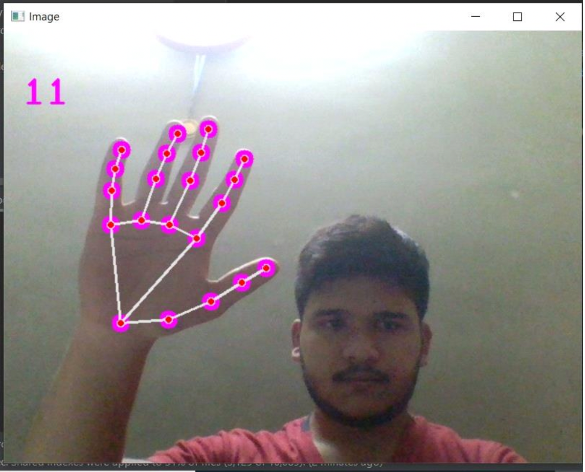

### Sneak peek into [BrightnessControl.py](BrightnessControl.py)

Our BrighnessControl.py file uses HandTrackingModule.py to work properly which is imported at the very beginning. Here we have defined the coordinates of fingers which we are using to control the LED. We have mainly used index and thumb fingers and these 4 coordinates as we can see in the piece of code below represent indexes of tips of Thumb and Index.
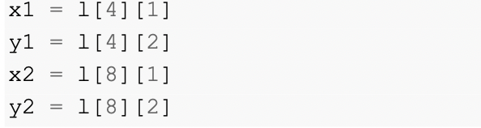
Now the piece of code that's responsible for the circles and line which we have drawn on the hand to show the control bar connecting the tip of the index and thumb fingers is shown below.
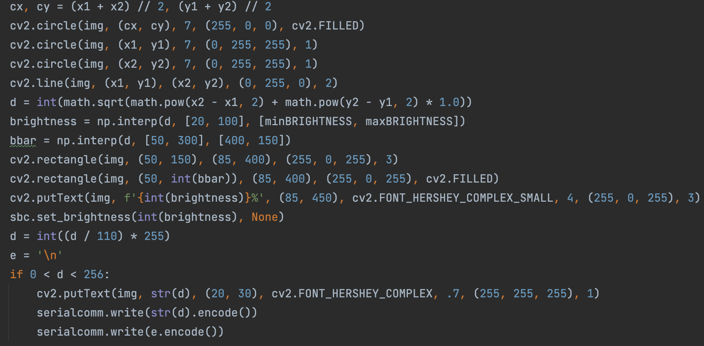
Distance is also calculated between index and thumb which is converted to a range of 0 - 255. This range data is then sent to the Arduino Nano V3 with the help of the Serial Library. 
The final image where distance has been calculated between the 2 fingers live via Webcam is shown below.

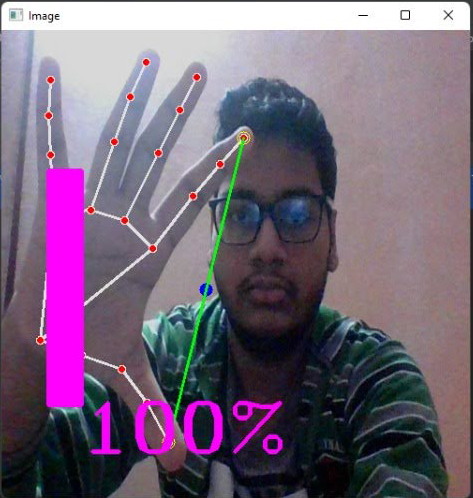
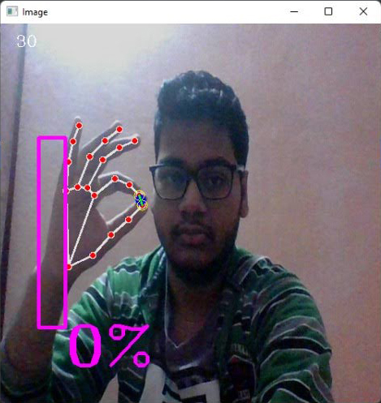

# Working of Arduino Code
First we need to make sure that our Arduino Board, Processor and Port have been configured properly in the Arduino IDE to avoid any connection error.
In the Menu Bar we need to select Tools > Board > Arduino Nano. Then we need to choose Tools > Processor > ATmega328P (Old Bootloader).
The Arduino Code stated in [sketch_dec10a.ino](sketch_dec10a.ino) is receiving data from our Laptop / PC through Serial Communication which is UART. Now lets get straight into the working of the code.

The piece of code written above is responsible for receiving the data serially which is being trasmitted by the [BrightnessControl.py](BrightnessControl.py). 
Here **'\n'** refers to escape sequence. Data is received when it comes across this character which is stored in the variable 'red' of type integer.
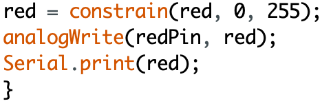
This code given above sets the data according to the received value which is in range of 0-255 as Arduino is a 8bit microcontroller. After the value is received, it is set and finally sent through serial communication which in turn triggers the LEDs connected to the circuit. 

# Circuit Diagram

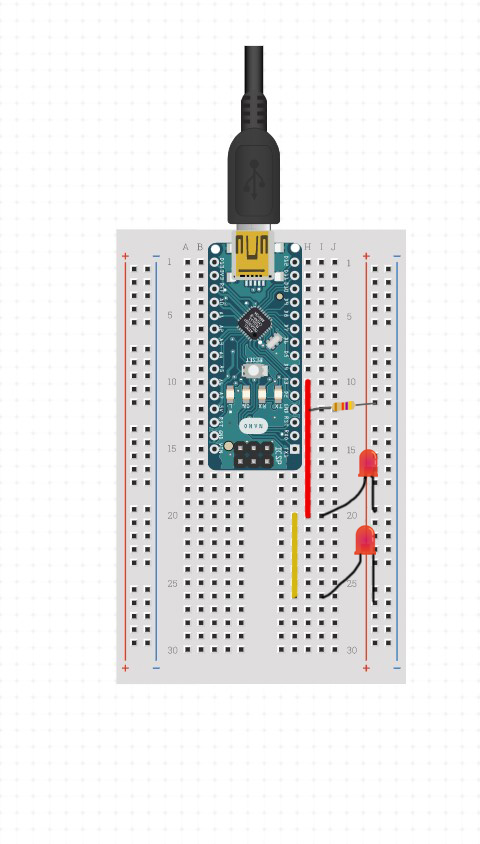

# Final Output

<figure class="video_container">
  <video controls="true" allowfullscreen="true" poster="./Images/VideoBanner.png">
    <source src="./Images/FinalOutputVideo.mp4" type="video/mp4">
  </video>
</figure>

